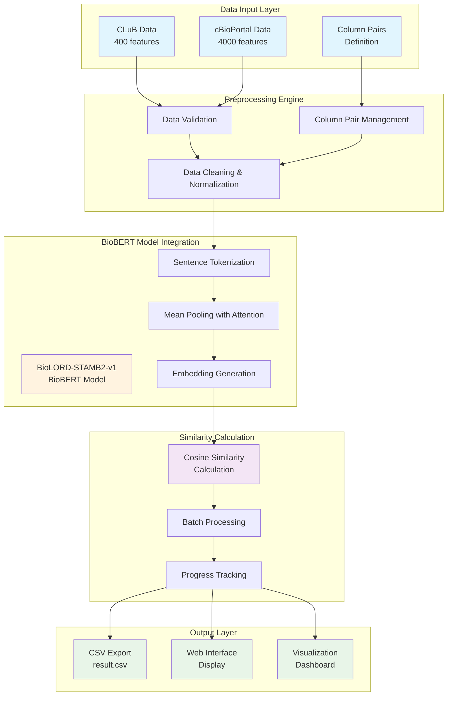
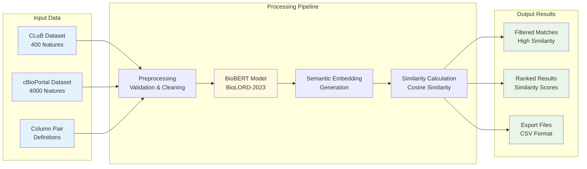
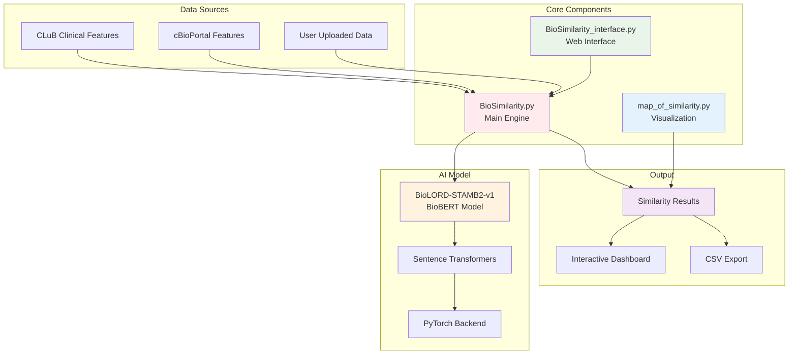
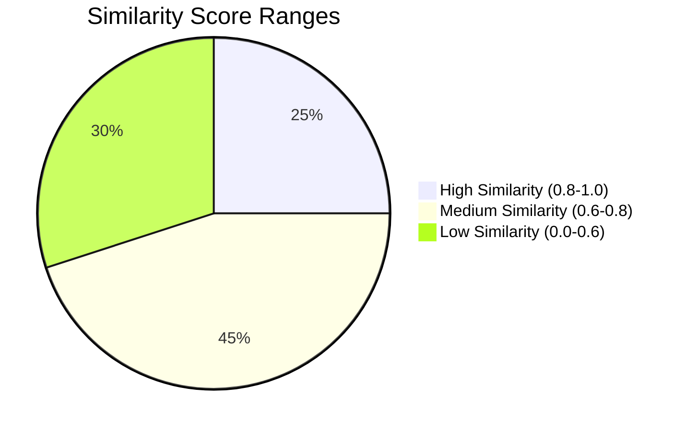
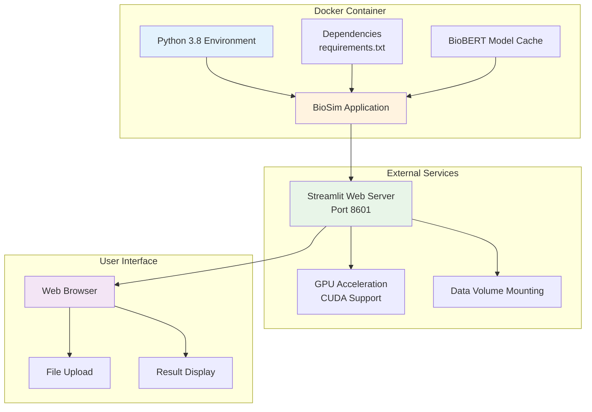

# BioSim: Biological Feature Harmonization System - Mermaid Diagrams

## System Architecture Diagram



## Data Flow Diagram



## Component Relationship Diagram



## Performance Comparison Diagram

```mermaid
graph LR
    subgraph "Traditional Approach"
        A1[400 CLuB Features]
        A2[4000 cBioPortal Features]
        A3[1,600,000<br/>Brute Force Comparisons]
        A4[O(n²) Complexity]
    end
    
    subgraph "BioSim Approach"
        B1[Semantic Filtering]
        B2[~10,000 Meaningful<br/>Comparisons]
        B3[O(n) Complexity]
        B4[99.4% Reduction]
    end
    
    A1 --> A3
    A2 --> A3
    A3 --> A4
    
    B1 --> B2
    B2 --> B3
    B3 --> B4
    
    style A3 fill:#ffcdd2
    style B2 fill:#c8e6c9
    style B4 fill:#4caf50
```

## Similarity Score Distribution



## Deployment Architecture



## Usage Instructions

You can use these Mermaid diagrams in:

1. **GitHub**: Copy the code blocks into GitHub markdown files
2. **GitLab**: Mermaid is natively supported
3. **Notion**: Use Mermaid code blocks
4. **Obsidian**: Enable Mermaid plugin
5. **Typora**: Native Mermaid support
6. **Online Mermaid Editor**: https://mermaid.live/

### Example Usage in GitHub:
```markdown
# BioSim Architecture

```mermaid
[Paste any of the diagram code blocks here]
```
```

The **`biosim_mermaid_diagram.md`** file contains all the diagrams you need for your paper and presentations. You can copy individual diagram code blocks and use them wherever Mermaid is supported. 